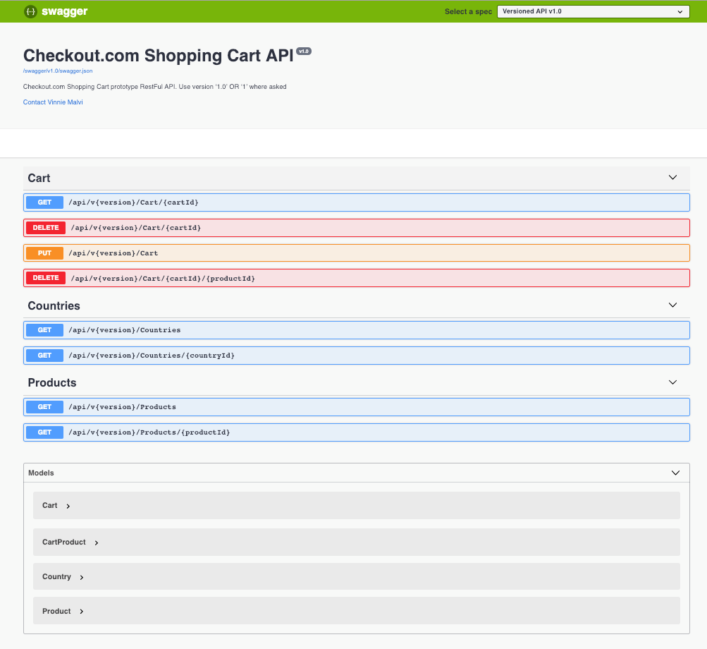

<h1>Shopping Cart API</h1>

Current Api Version: 1.0

This API can be tested with real data using SwaggerUI. Set the Checkout.Web as startup project and run the project. Once the project is running, you can access the SwaggerUI at http://localhost:[port]/swagger. (Replace the port number with the Checkout.Web port running in the browser.)

<h2>Prerequisites</h2>
<ul>
    <li>Visual Studio 2017</li>
    <li>ASP.NET Core 2.2</li>
    <li>Visual Studio Code 1.31.1</li>
</ul>

<h3>Steps to run</h3>
<ul>
    <li>Build Solution</li>
    <li>Start with or without debugging with IIS Express on Visual Studio</li>
    <li>Navigate to http://localhost:[port]/swagger to test the API's using Swagger UI</li>
</ul>

<h2>Solution</h2>

This test consists of the following projects:

<ul>
<li><strong>Checkout.BusinessLogic</strong></li>
Contains business logic for services and repositories responsible for data operations, such as retrieving and saving data;  

<li><strong>Checkout.BusinessLogic.Tests</strong></li>
Unit tests for Checkout.BusinessLogic;  

<li><strong>Checkout.EF</strong></li>
Contains database configuration (such as model indexes or complex keys) and initialsation i.e. seed data. The current prototype uses an In Memory representation of the database;  

<li><strong>Checkout.Models</strong></li>
Contains entity definitions which describe the structures in which data can be saved, i.e. tables;  

<li><strong>Checkout.Web</strong></li>
The core WebApi application, containing REST API controller Endpoints for countries, products and cart management;  

<li><strong>Checkout.Web.Client</strong></li>
Contains generated client library code, based off nswag.json configuration file and generated using NSwag (https://blog.rsuter.com/nswag-tutorial-integrate-the-nswag-toolchain-into-your-asp-net-web-api-project/). Examples are available in CSharp and Typescript;  

<li><strong>Checkout.Web.Console</strong></li>
Provides a real world example of how to use the CSharp client library code in Checkout.Web.Client. The file Program.cs demonstrates how to use the Client Library and has examples of each endpoint usage.  

<li><strong>Checkout.Web.Tests</strong></li>
Unit tests for Checkout.Web.  
</ul>

<h2>Swagger UI</h2>

<h2>Setup</h2>

NodeJS must be installed on your system.

Clone or download this repository to your local machine. Then click the file Checkout.com.sln file, this should open the solution correctly whereby you will be presented with an N-layer solution.

Ensure you set the Startup project to Checkout.Web. Restore all Nuget and npm packages, then, right click the solution icon and select BUILD.

<h2>Assumptions</h2>
<ul>
    <li>UK and Germany are used as default companies for products.</li>
    <li>Total 6 sample products are being used, 3 each for the countries.</li>
    <li>Cart Id is GUID.</li>
</ul>
